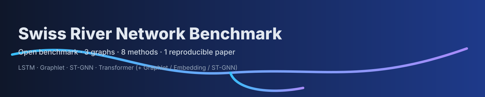
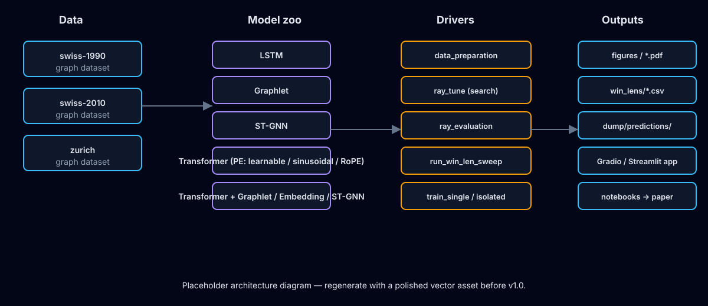
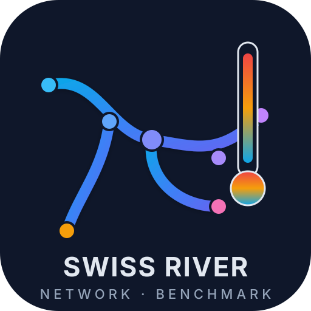
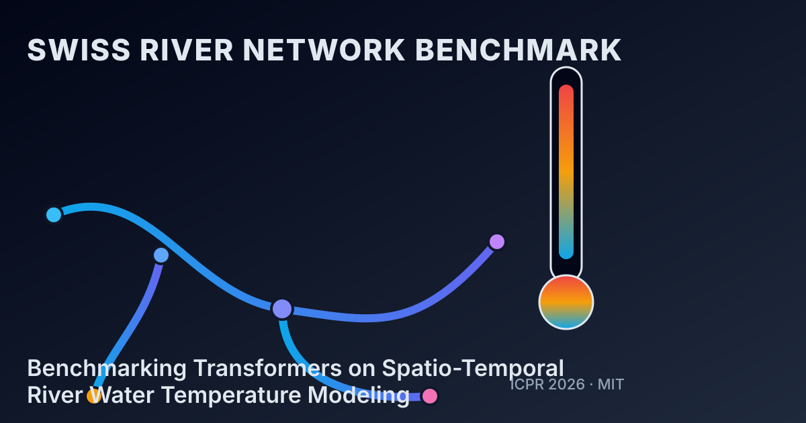

<div align="center">



# Swiss River Network Benchmark

<strong>Benchmarking Transformers on Spatio-Temporal River Water Temperature Modeling</strong><br/>
<em>ICPR 2026 submission · open-source reference code, datasets, and figures</em>

[](https://github.com/jajupmochi/swiss-river-network-benchmark/actions/workflows/ci.yml)
[](https://jajupmochi.github.io/swiss-river-network-benchmark/)
[](LICENSE)
[](https://www.python.org/)
[](https://github.com/astral-sh/ruff)
[](https://huggingface.co/spaces/jajupmochi/swiss-river-network-benchmark)
[](#citation)

**Language:** **English** · [简体中文](README.zh.md) · [Deutsch](README.de.md) · [Français](README.fr.md)

</div>

---

## TL;DR

Swiss River Network Benchmark is a **reproducible** open benchmark for spatio-temporal river
water-temperature forecasting. It ships:

- **Three graph datasets** — `swiss-1990`, `swiss-2010`, `zurich` — derived from Swiss
  hydrological stations.
- **Eight reference methods** — LSTM, Graphlet, LSTM+station-embedding, ST-GNN,
  Transformer (with learnable / sinusoidal / RoPE positional encodings), and graph-aware
  Transformer variants (Transformer-Graphlet, Transformer-Embedding, Transformer-ST-GNN).
- **The full paper pipeline** — Ray Tune hyperparameter search, test-time evaluation,
  window-length sweep (Fig. 4 + HLE), Gaussian / impulse noise robustness study (Figs. 5–6),
  and visualization notebooks that re-produce every paper figure from CSVs.
- **Five installation paths** — `uv`, `pip`, Docker, desktop click-to-run installer, and a
  paste-once prompt for Claude Code / Codex / Gemini / Copilot.
- **An interactive demo** on Hugging Face Spaces and a richer **local Streamlit UI**,
  both embedding the project's real visualization code.

> ⚠️ **GPU with CUDA is required** for training and evaluation. The demo apps and
> documentation-only workflows run on CPU.

## Table of contents

1. [Gallery](#gallery)
2. [Quickstart (≤ 30 s)](#quickstart--30-s)
3. [Install — five paths](#install--five-paths)
   - [A. Developer install via `uv`](#a-developer-install-via-uv-recommended)
   - [B. `pip`](#b-pip-install)
   - [C. Docker](#c-docker)
   - [D. Desktop installer (Windows / macOS / Linux)](#d-desktop-installer-windows--macos--linux)
   - [E. LLM-agent paste-and-run](#e-llm-agent-paste-and-run)
4. [Reproducing the paper](#reproducing-the-paper)
5. [Live demo & local UI](#live-demo--local-ui)
6. [Project layout](#project-layout)
7. [CLI reference](#cli-reference)
8. [Documentation](#documentation)
9. [Contributing](#contributing)
10. [Citation](#citation)
11. [Acknowledgments](#acknowledgments)
12. [License](#license)

## Gallery

<table>
  <tr>
    <td align="center" width="33%"><strong>Fig. 2 — HLE / robustness radar</strong><br/>
      <br/>
      <sub>(Placeholder — see <code>visualize_results/figures/all_resu_radar_grid_plot.pdf</code>.)</sub>
    </td>
    <td align="center" width="33%"><strong>Fig. 4 — window-length sweep</strong><br/>
      <br/>
      <sub>(Placeholder — produced by <code>window_lens_resu.ipynb</code>.)</sub>
    </td>
    <td align="center" width="33%"><strong>Sankey — method / graph choices</strong><br/>
      <br/>
      <sub>(Placeholder — produced by <code>sankey.ipynb</code>.)</sub>
    </td>
  </tr>
</table>

> Run `uv run python scripts/export_assets.py --only figures --dpi 200` after a full
> reproduction to rasterise the real paper figures into `assets/export/figures/` for
> embedding.

## Quickstart (≤ 30 s)

```bash
git clone https://github.com/jajupmochi/swiss-river-network-benchmark.git
cd swiss-river-network-benchmark
uv sync --no-cache

# Smoke-check the install.
uv run srn --help
uv run srn version
```

Launch the interactive demo locally:

```bash
uv run srn app streamlit          # full local UI
# or
uv run srn app gradio             # Gradio (also used for the HF Space)
```

## Install — five paths

> The benchmark is designed so you can pick the install path that fits your role.

### A. Developer install via `uv` (recommended)

```bash
git clone https://github.com/jajupmochi/swiss-river-network-benchmark.git
cd swiss-river-network-benchmark
uv sync --no-cache                     # reproducible environment from uv.lock
uv run srn --help                      # console entry point
```

Optional extras:

```bash
uv sync --all-extras                   # everything
uv pip install -e '.[app]'             # demo apps only
uv pip install -e '.[docs]'            # mkdocs + i18n + mike
uv pip install -e '.[dev]'             # ruff, pytest, nbmake, pre-commit
```

### B. `pip` install

```bash
python -m pip install 'swissrivernetwork[app]'          # once published on PyPI
# or from a clone:
pip install -e '.[app]'
```

Minimum Python 3.12. GPU with CUDA 12.1+ is required for training; demos run CPU-only.

### C. Docker

> Requires an NVIDIA GPU + nvidia-container-toolkit for training workloads.

```bash
docker compose up app                  # Streamlit UI on http://localhost:8501
docker compose run --rm train srn sweep
```

### D. Desktop installer (Windows / macOS / Linux)

If you are a hydrologist or practitioner and don't want to touch the command line, grab a
ready-made installer from the [Releases page](https://github.com/jajupmochi/swiss-river-network-benchmark/releases)
and double-click:

| Platform | Artefact |
| --- | --- |
| Windows 10/11 x64 | `SwissRiverNetworkBenchmark-<ver>-win64.exe` |
| macOS (Apple Silicon) | `SwissRiverNetworkBenchmark-<ver>.dmg` |
| Linux x64 | `SwissRiverNetworkBenchmark-<ver>-x86_64.AppImage` |

The desktop bundle launches the Streamlit UI locally, loads a bundled checkpoint, and
visualizes predictions on any station without requiring a Python or CUDA install. Training
workloads still require a GPU — for research use, prefer installer **A / B / C**.

Building locally (advanced):

```bash
uv sync --all-extras
uv run pyinstaller packaging/swissrivernetwork.spec
```

### E. LLM-agent paste-and-run

Open your favourite coding agent (Claude Code, Codex, Gemini CLI, or GitHub Copilot CLI)
and paste the prompt below. The agent will clone, install, prepare the data, run the
validation tests, and launch the UI — all within one turn.

> 📎 The full, copy-pasteable prompt lives at
> [`.claude/skills/install/SKILL.md`](.claude/skills/install/SKILL.md).

```text
Install the Swiss River Network Benchmark by cloning
https://github.com/jajupmochi/swiss-river-network-benchmark.git into the current directory,
running `uv sync --no-cache --all-extras`, smoke-checking with `uv run pytest -q`, and
then starting the Streamlit UI via `uv run srn app streamlit`. Read
.claude/skills/install/SKILL.md for the complete playbook before starting.
```

## Reproducing the paper

```bash
# 0.  Prepare the three dataset splits.
uv run srn prepare-data

# 1.  Hyperparameter search (per method, per graph).  Example: LSTM on swiss-2010.
uv run srn tune -m lstm -g swiss-2010 -n 200 -wl 90

# 2.  Evaluate tuned checkpoints and write the wl=90 tables.
uv run srn evaluate

# 3.  Window-length sweep → paper Fig. 4 + the HLE dimension of Fig. 2.
uv run srn sweep

# 4.  Render figures from CSVs.
uv run jupyter lab swissrivernetwork/benchmark/visualize_results/
```

The window-length sweep runs in two strict phases:

1. **ISOLATED** — `lstm`, `transformer` (× PE in `{learnable, sinusoidal, rope}`). Writes
   `wt_hat` predictions under `dump/predictions/<path_extra_keys>-evalwl{W}/`.
2. **GRAPHLET** — `graphlet`, `transformer_graphlet`. Reads Phase-1 dumps as neighbor
   features.

> 🐛 **Reproducibility note.** Earlier sweep runs were affected by two bugs that have now
> been fixed:
>
> 1. *Eval-window leakage* in the isolated dump path (all sweep rows at W ≠ 90 for graphlet
>    were silently reading the longest-W prediction).
> 2. *Outer-join NaN* in `merge_graphlet_dfs` at W > trained_wl.
>
> Both fixes are on `main` since `4daeff3`. Graphlet and Transformer-Graphlet sweep rows
> at W ≠ 90 need to be regenerated; everything at W = 90 is unaffected. See
> [`CHANGELOG.md`](CHANGELOG.md) for details.

## Live demo & local UI

| Target | Command | Notes |
| --- | --- | --- |
| Hugging Face Space | [🤗 Open the demo](https://huggingface.co/spaces/jajupmochi/swiss-river-network-benchmark) | Gradio front-end, live predictions on bundled checkpoints. |
| Local Gradio | `uv run srn app gradio` | Same app as the HF Space. |
| Local Streamlit | `uv run srn app streamlit` | Explore / Predict / Compare tabs, reuses the project's existing visualization code. |
| Desktop installer | double-click the `.exe` / `.dmg` / `.AppImage` | Same Streamlit UI, bundled. |

Both demo apps include **real-time visualization** built directly from the notebooks under
`swissrivernetwork/benchmark/visualize_results/` — no mocked data.

## Project layout

```
swiss-river-network-benchmark/
├── swissrivernetwork/
│   ├── cli.py                              # `srn` entry point (typer, forwards to drivers)
│   ├── benchmark/
│   │   ├── data_preparation.py             # build dataset splits
│   │   ├── ray_tune.py                     # hyperparameter search
│   │   ├── ray_evaluation.py               # test-time evaluation
│   │   ├── run_win_len_sweep.py            # window-length sweep (Fig. 4 / HLE)
│   │   ├── train_single_model.py
│   │   ├── train_isolated_station.py
│   │   ├── util.py                         # merge_graphlet_dfs, get_evaluation_path_keys…
│   │   ├── dataset.py                      # readers + SequenceDataset(Windowed)
│   │   └── visualize_results/              # notebooks that produce every paper figure
│   ├── app/
│   │   ├── gradio_app.py                   # HF Space + local Gradio
│   │   └── streamlit_app.py                # local UI with live visualization
│   └── …                                   # experiment helpers, NN modules, utilities
├── assets/                                  # logo, social card, architecture diagram
├── docs/                                    # MkDocs Material site (en / zh / de / fr)
├── packaging/                               # PyInstaller spec + platform entry scripts
├── scripts/                                 # export_assets.py, smoke helpers
├── tests/
├── .claude/skills/                          # Claude Code skills (install, run-benchmark)
├── pyproject.toml                           # PEP 621 metadata, extras, console scripts
├── CITATION.cff
├── CHANGELOG.md
├── CODE_OF_CONDUCT.md
├── CONTRIBUTING.md
├── SECURITY.md
└── LICENSE
```

## CLI reference

All subcommands of `srn` forward straight to the canonical drivers — they exist so you get
an installable `srn` command after a `pip install`:

| Command | Underlying driver |
| --- | --- |
| `srn prepare-data` | `python -m swissrivernetwork.benchmark.data_preparation` |
| `srn tune -m <method> -g <graph> …` | `python -m swissrivernetwork.benchmark.ray_tune …` |
| `srn evaluate` | `python -m swissrivernetwork.benchmark.ray_evaluation` |
| `srn sweep` | `python -m swissrivernetwork.benchmark.run_win_len_sweep` |
| `srn train-single` | `python -m swissrivernetwork.benchmark.train_single_model` |
| `srn train-isolated` | `python -m swissrivernetwork.benchmark.train_isolated_station` |
| `srn app gradio` | Launch the Gradio demo. |
| `srn app streamlit` | Launch the Streamlit local UI. |
| `srn version` | Print the installed package version. |

Pass driver-specific flags after `--`:

```bash
uv run srn tune -m transformer_embedding -g swiss-2010 -n 200 -wl 90 -pe rope
```

For the complete flag list see [`.claude/skills/run-benchmark/SKILL.md`](.claude/skills/run-benchmark/SKILL.md)
or run any driver with `--help`.

## Documentation

The full documentation site is built with MkDocs Material and shipped in four languages.

| URL | Language |
| --- | --- |
| <https://jajupmochi.github.io/swiss-river-network-benchmark/> | English (default) |
| <https://jajupmochi.github.io/swiss-river-network-benchmark/zh/> | 简体中文 |
| <https://jajupmochi.github.io/swiss-river-network-benchmark/de/> | Deutsch |
| <https://jajupmochi.github.io/swiss-river-network-benchmark/fr/> | Français |

Sections include: **Getting started**, **User guide (for hydrologists)**,
**Tutorials**, **Paper reproduction**, **API reference**, **Explainers**,
**Developer guide**, **Citation**, and **FAQ**.

Build locally:

```bash
uv pip install -e '.[docs]'
uv run mkdocs serve
```

## Contributing

- Please read [`CONTRIBUTING.md`](CONTRIBUTING.md) before opening an issue / PR.
- Bug reports, feature requests, and paper-reproduction questions each have a dedicated
  issue template.
- Participation is governed by the [Code of Conduct](CODE_OF_CONDUCT.md).
- Security issues follow a private disclosure process — see [`SECURITY.md`](SECURITY.md).

Open tasks and upcoming milestones are tracked on the
[GitHub issue tracker](https://github.com/jajupmochi/swiss-river-network-benchmark/issues).

## Citation

If you use this benchmark in academic work please cite both the software and the paper.

**Software (Zenodo DOI goes here after first release):**

```bibtex
@software{jia_swissrivernetwork_2026,
  author    = {Linlin Jia and Benjamin Fankhauser},
  title     = {Swiss River Network Benchmark: Spatio-Temporal River Water Temperature Modeling},
  year      = {2026},
  version   = {0.1.0},
  url       = {https://github.com/jajupmochi/swiss-river-network-benchmark},
  license   = {MIT}
}
```

**Paper (ICPR 2026 submission — placeholder, update after acceptance):**

```bibtex
@inproceedings{jia_transformers_rivertemp_2026,
  author    = {Linlin Jia and Benjamin Fankhauser},
  title     = {Benchmarking Transformers on Spatio-Temporal River Water Temperature Modeling},
  booktitle = {International Conference on Pattern Recognition (ICPR)},
  year      = {2026},
  note      = {Under review.}
}
```

GitHub also ships a machine-readable [`CITATION.cff`](CITATION.cff) — the "Cite this
repository" button on the repo page resolves both entries automatically.

## Acknowledgments

This benchmark builds on prior work by **Benjamin Fankhauser** and the hydrology group at
the **University of Bern**. We thank the Swiss Federal Office for the Environment (FOEN),
Zurich's **Amt für Abfall, Wasser, Energie und Luft (AWEL)**, and collaborating public
observatories for the station measurements that make this dataset possible.

Infrastructure and tooling: [PyTorch](https://pytorch.org/),
[PyTorch Geometric](https://pyg.org/), [Ray Tune](https://www.ray.io/ray-tune),
[Hugging Face](https://huggingface.co/), [Gradio](https://www.gradio.app/),
[Streamlit](https://streamlit.io/), [MkDocs Material](https://squidfunk.github.io/mkdocs-material/),
[uv](https://github.com/astral-sh/uv).

## License

MIT — see [`LICENSE`](LICENSE).
