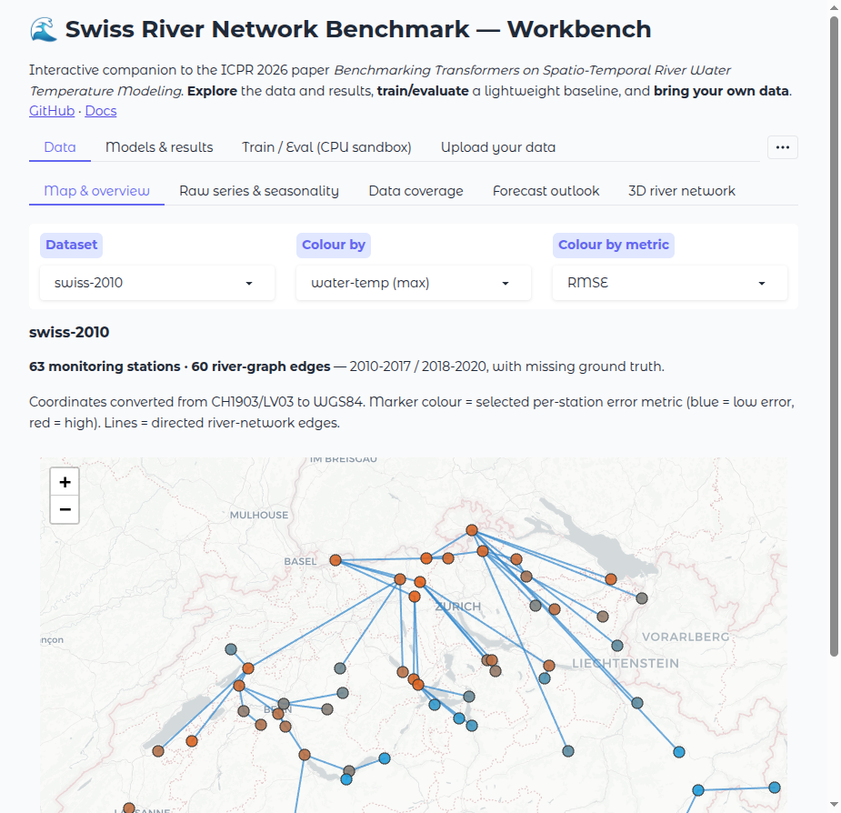

# Interactive workbench

The **workbench** is a one-command, browser-based application for exploring the
benchmark, training and evaluating quick baselines, running **your own model**,
and analysing predictions — with an emphasis on being usable by hydrologists who
do not want to write code. The *same* application powers both the hosted
[Hugging Face Space](https://huggingface.co/spaces/jajupmochi/swiss-river-network-benchmark)
and the local app, from a single source file, so what you see online is exactly
what you run locally.



- **Local:** `uv run srn app gradio` (or `python -m swissrivernetwork.app.workbench`)
- **Hosted:** open the Space — no install required.

!!! tip "Who is this for?"
    Two audiences are served side by side. **Hydrologists and water managers**
    get a map, seasonal cycles, a drought-portal-style outlook, and ecological
    threshold analysis without touching a line of code. **ML researchers** get
    the full result set (window-length, forecasting horizon, noise robustness,
    per-station error, radar, ranking) plus a bring-your-own-model inference and
    analysis workflow.

## Launching it

```bash
# Recommended: installs the app extra (gradio, folium, …) on first run.
uv run srn app gradio
# Equivalent:
uv run python -m swissrivernetwork.app.workbench
```

The app opens on <http://127.0.0.1:7860>. Useful environment variables:

| Variable | Default | Meaning |
| --- | --- | --- |
| `SRN_HOST` | `0.0.0.0` | Interface to bind. Set to `127.0.0.1` to keep it private to your machine. |
| `SRN_PORT` | `7860` | Port to serve on. |
| `SRN_WORKBENCH_DATA` | *(bundled)* | Path to an alternative data bundle. Overrides the packaged demo data. |

### Compute: CPU and GPU are detected automatically

The **Inference** tab shows the environment it detected — CPU cores, RAM, and,
if PyTorch sees a CUDA device, the GPU name and memory. You do not configure
anything:

- **scikit-learn** models (`.joblib` / `.pkl`) always run on **CPU**.
- **TorchScript** models (`.pt`) run on the **GPU when one is available**
  (choose `auto`, `cpu`, or `cuda` in the *Device* selector), otherwise on CPU.

PyTorch is optional. On the hosted Space it is absent, so only the CPU
(scikit-learn) path is offered; locally, if `torch` is installed (it is a core
dependency of the benchmark), the GPU path is enabled automatically.

## What each tab does

### Data — for understanding the rivers

| View | What it shows | Why a hydrologist cares |
| --- | --- | --- |
| **Map & overview** | Monitoring stations on a Swiss basemap with the river-network graph; markers coloured by water temperature or a chosen per-station error metric. | See the network at a glance; spot which reaches run warm or where a model struggles. |
| **Raw series & seasonality** | Per-station air/water-temperature time series and the day-of-year climatological cycle (mean ± standard deviation). | Inspect data quality, gaps, and the seasonal envelope of a station. |
| **Data coverage** | A station × time heatmap of where ground-truth water temperature exists. | Understand missing-data structure before trusting a metric. |
| **Forecast outlook** | A probabilistic outlook for the coming weeks in the style of the Swiss drought portal (drought.ch): a p10–p90 day-of-year climatology band with the median and ecological-threshold lines. | A familiar, decision-oriented view of "how warm might it get". |
| **3D river network** | An interactive three.js scene: stations placed by coordinates, raised and coloured by value, with the river edges on the base plane. | An intuitive spatial picture of the network and its temperatures. |

### Models & results — for comparing architectures

| View | What it shows |
| --- | --- |
| **Multi-aspect radar** | Each model on nine normalised axes (now-cast RMSE/MAE/NSE, forecast RMSE/MAE/NSE, Gaussian- and impulse-noise robustness, window efficiency). You can overlay your own per-station metrics file. |
| **Window-length sweep** | Error versus the length of the history window (the data behind paper Fig. 4). |
| **Forecasting horizons** | Error versus how many days ahead the model predicts. |
| **Noise robustness** | Error versus injected Gaussian or impulse noise. |
| **Per-station error** | A bar chart of a chosen metric per station for one model. |
| **Results table** | Every per-statistic value (mean / median / std / min / max) for the eight architectures. |
| **Positional encoding** | A visualisation of the sinusoidal positional-encoding matrix. |

### Train / Eval — a lightweight CPU sandbox

- **Train a baseline** fits a `scikit-learn` Ridge regression or a small MLP on a
  window of past air temperature for one station, live, on CPU. It is meant for
  illustration and quick intuition — it is **not** one of the paper's GPU models.
  The trained model is remembered and can be reused in the Inference and Analysis
  tabs (choose *Last trained sandbox model*).
- **Evaluate predictions** scores a CSV of your own predictions against the
  bundled test ground truth for a station (RMSE / MAE / NSE).

### Inference & prediction — bring your own model

Run predictions and watch them appear:

1. Pick a **dataset**, **station**, and **split**.
2. Choose a **model source**: the *last sandbox model* you trained, or an
   *uploaded model file*.
3. For an uploaded model, drop in a file:
    - a **scikit-learn** estimator saved with `joblib`/`pickle`
      (`.joblib` / `.pkl`), exposing `.predict(X)`, or
    - a **TorchScript** module (`.pt`) — runs on the GPU if available.
   The input `X` is a window of the past *N* daily air-temperature values; set
   **window** to match the number of input features your model expects.
4. Press **Predict** for the full series, or **Predict live (streaming)** to see
   the prediction drawn progressively — a real-time output feel.

!!! warning "Security"
    A model file executes code when it is loaded. Only upload models you trust.
    This capability runs locally on your machine (the hosted Space accepts only
    the CPU scikit-learn path).

### Analysis — where and how a model is right or wrong

| Analysis | What it answers |
| --- | --- |
| **Residuals** | Residual (prediction − observation) over time and its distribution; reports mean bias, spread, and the fraction of days with an error above 2 °C. |
| **Seasonal error** | Mean absolute error by calendar month — is the model worst in the summer fish-stress season? |
| **Threshold exceedance** | Observed days per year above an ecological/regulatory limit (e.g. 25 °C fish-stress, 21 °C grayling stress). |
| **Model ranking** | The eight architectures ranked by their mean per-station error on a dataset. |

### Upload your data

Drop a `.csv`, `.tsv`, `.xlsx`, `.xls`, `.json`, or `.parquet` file (≤ 50 MB,
parsed in memory, never stored). The app auto-detects the content and routes it:

1. **Time series** — needs a time/index column (`date`/`datetime`/`time`, or an
   integer `epoch_day` = days since 1970-01-01; otherwise the first column) and
   at least one numeric value column. Up to 12 numeric columns are plotted.
2. **Benchmark result curve** — a `window_len`, `future_step`, or `noise_level`
   column becomes the x-axis automatically.
3. **Per-station metrics** — a `Station` column plus `RMSE`/`MAE`/`NSE` becomes a
   per-station bar chart.

Malformed, empty, oversized, or non-numeric files return a clear message rather
than crashing.

## Data & model format reference

| Kind | Accepted | Contract |
| --- | --- | --- |
| Upload data | `.csv .tsv .xlsx .xls .json .parquet` | see the three routes above |
| Model (CPU) | `.joblib .pkl .pickle` | a scikit-learn-style object with `.predict(X)` |
| Model (GPU) | `.pt .ts` | a TorchScript module callable on a `(rows, window)` float tensor |
| Predictions | `.csv .tsv .xlsx …` | one numeric column named like `prediction` / `wt_hat` / `yhat` |

## A hydrologist walkthrough

A worked example — no coding:

1. **Map & overview** → pick `zurich`, colour by *water-temp (max)*. Identify a
   station that runs warm.
2. **Raw series & seasonality** → select that station; read its seasonal envelope
   and check for gaps.
3. **Forecast outlook** → set the threshold to *25 °C (fish-stress / regulatory)*
   and a 4-week horizon; read the p10–p90 band against the line.
4. **Threshold exceedance** → see how many days per year that station has
   historically exceeded 25 °C, and which year was worst.
5. **Train a baseline** → fit a Ridge model on that station in a few seconds.
6. **Inference → live** → replay the prediction against the observed series.
7. **Analysis → seasonal error** → confirm whether the baseline is weakest in
   summer, exactly when ecological risk is highest.

## Automated tests

The workbench is covered by an automated test suite exercising every loader,
visualization, the map and 3D view, the train/eval sandbox, model upload
(scikit-learn and TorchScript), inference and live streaming, and all four
analyses over the bundled data:

```bash
uv run --extra app --with pytest python -m pytest -q swissrivernetwork/app/test_workbench.py
```

## Troubleshooting

| Symptom | Fix |
| --- | --- |
| `ModuleNotFoundError: gradio` / `folium` | Install the app extra: `uv sync --extra app` (or run via `uv run srn app gradio`, which does it for you). |
| Inference error about feature size | Set **window** to the number of input features your uploaded model expects. |
| TorchScript upload rejected as "needs PyTorch" | You are on an environment without `torch` (e.g. the hosted Space). Use a `.joblib` model, or run locally. |
| No GPU shown though you have one | Confirm `python -c "import torch; print(torch.cuda.is_available())"` is `True` in the same environment. |
| A dataset shows "No series" | That dataset's raw series are not in the current data bundle. Point `SRN_WORKBENCH_DATA` at a full bundle. |
