# Architecture — Swiss River Network Benchmark

Every architecture and data-flow diagram for the project, in Mermaid. It opens with the
**design plan** (the catalogue of diagrams and why each exists), then implements them,
grouped into *System*, *Data flows*, *Runtime / app*, and *Deployment*.

## Design plan — the diagram catalogue

| # | Diagram | Answers | Group |
|---|---|---|---|
| 1 | System framework | What are the top-level components and how do they relate? | System |
| 2 | Package & CLI map | Which `srn` command runs which module? | System |
| 3 | Model taxonomy | How do 4 classes × 2 backbones give 8 reference models? | System |
| 4 | Reproduction tiers | What are Tier 0/1/2 and their cost? | System |
| 5 | Data preparation flow | Raw records → released graph/series/split artifacts | Data flow |
| 6 | Training flow | Dataset → model → NaN-masked loss → validation → best checkpoint | Data flow |
| 7 | Hyper-parameter search | How Ray Tune + ASHA select per (model, dataset) | Data flow |
| 8 | Evaluation & window sweep | Checkpoints → metrics → per-station / aggregate CSVs | Data flow |
| 9 | Result-artifact provenance | Which CSV backs which figure / table / workbench view | Data flow |
| 10 | Workbench runtime | CSVs + uploads → one Gradio app → six tab groups | Runtime |
| 11 | Bring-your-own-model inference | Upload → load → device → windowed predict → stream | Runtime |
| 12 | Upload auto-routing | How an arbitrary file is detected and plotted | Runtime |
| 13 | Deployment & CI/CD | Local vs Space, single source, and the pipelines | Deployment |

---

## System

### 1. System framework

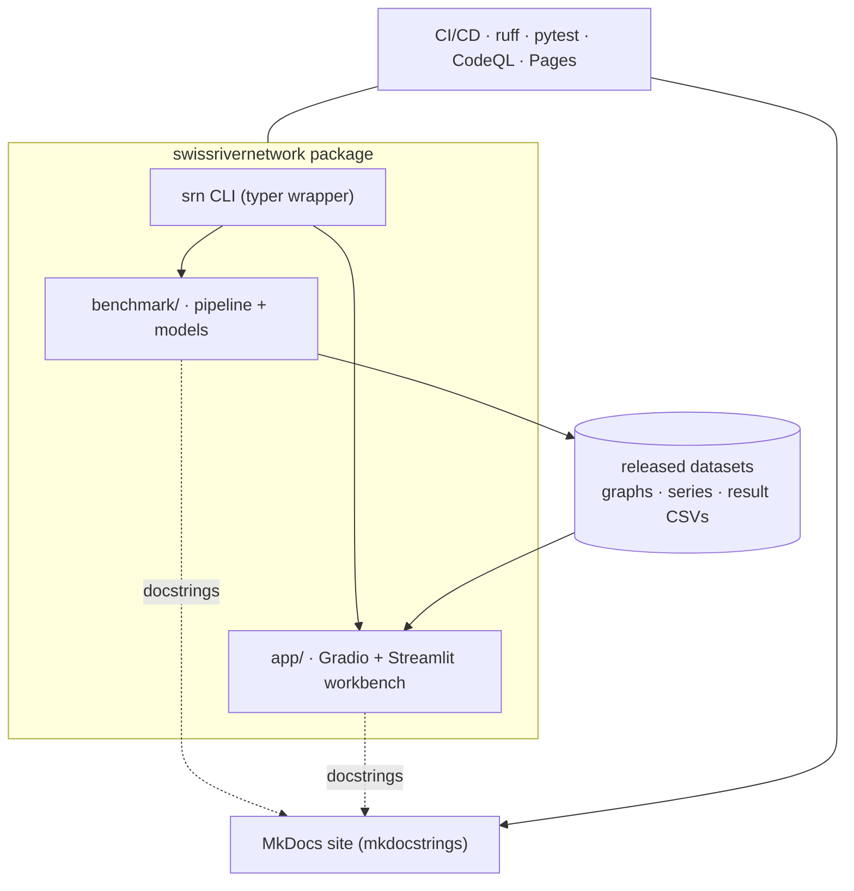

### 2. Package & CLI map

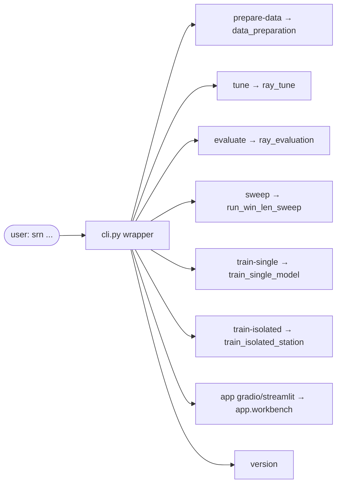

### 3. Model taxonomy — 8 reference models

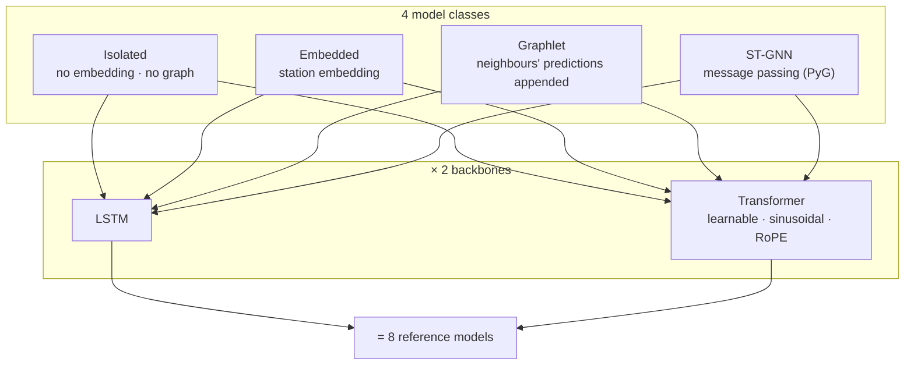

### 4. Reproduction tiers

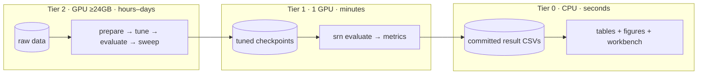

---

## Data flows

### 5. Data preparation flow

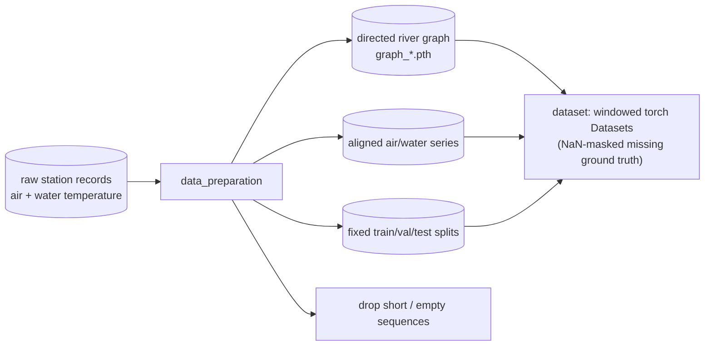

### 6. Training flow

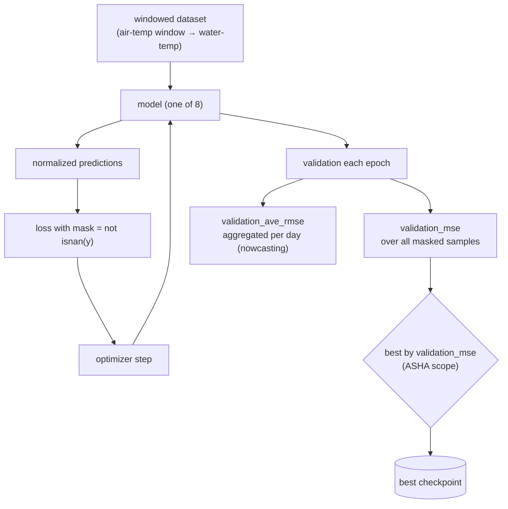

> The selection metric is `validation_mse` (never aggregated). `validation_ave_rmse` is a
> logged diagnostic that aggregates overlapping windows to one prediction/day for windowed
> nowcasting — see the 2026-07-04 audit report.

### 7. Hyper-parameter search (Ray Tune + ASHA)

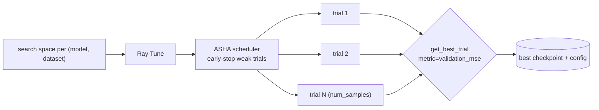

### 8. Evaluation & window-length sweep

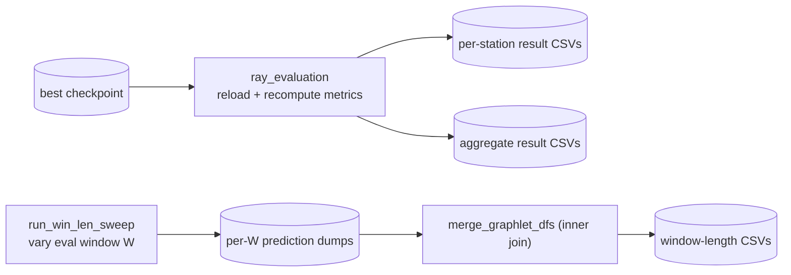

> The sweep uses provenance-keyed dump paths (`-evalwl{W}`) and an inner join so a shorter
> window can never read a longer window's dump — the two reproduction bugs fixed and
> regression-tested in the library.

### 9. Result-artifact provenance

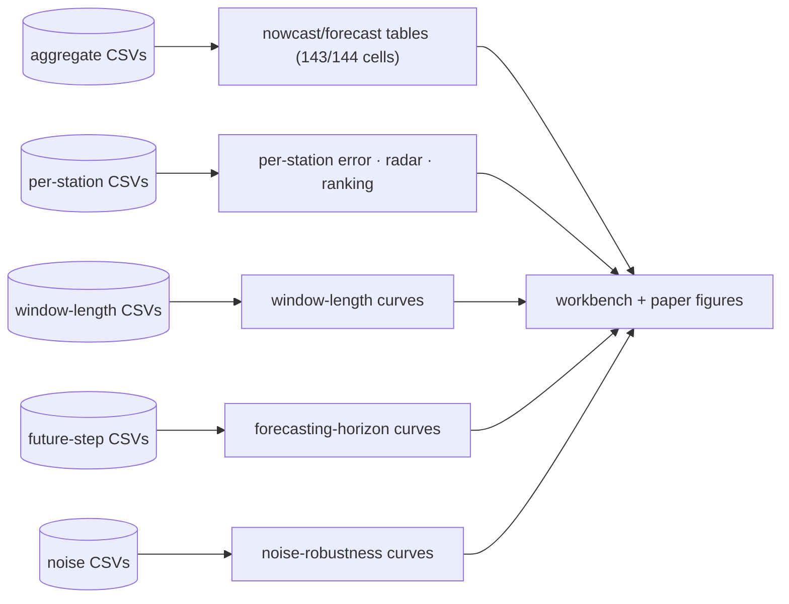

---

## Runtime / app

### 10. Workbench runtime architecture

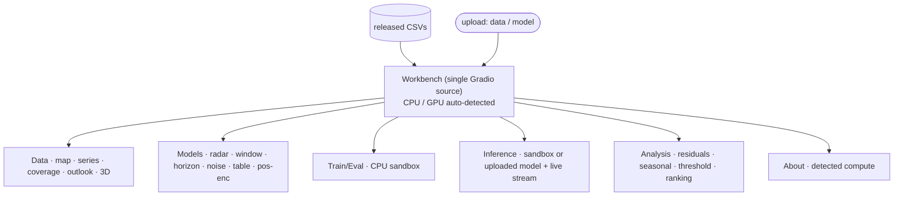

### 11. Bring-your-own-model inference

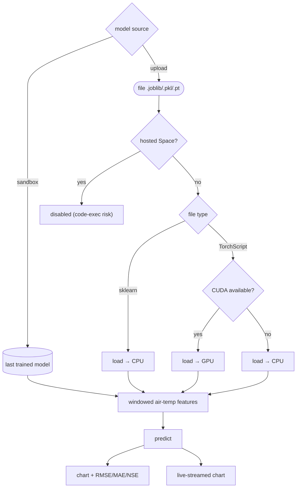

### 12. Upload auto-routing

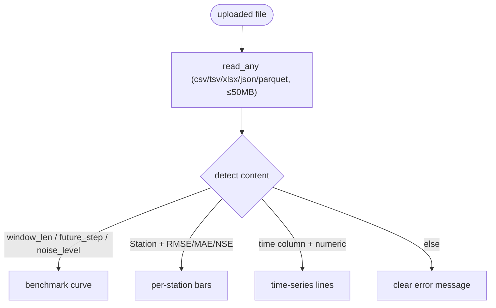

---

## Deployment

### 13. Deployment & CI/CD topology

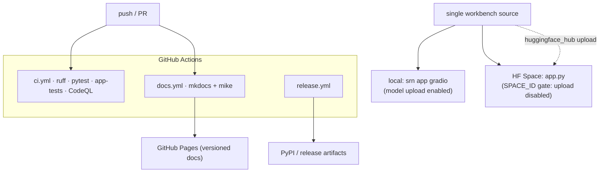

---

## Notes

- All diagrams are validated to parse with Mermaid 11.
- The pipeline stages (1, 5–8) map one-to-one onto the four `srn` commands
  (`prepare-data → tune → evaluate → sweep`); everything downstream (Tier 0) is CPU-only.
- The workbench (10–12) is intentionally a *single* source file so the local app and the
  Hugging Face Space cannot drift; the only runtime difference is the `SPACE_ID` upload
  gate (11) and CPU/GPU auto-detection.
