# Interactive workbench — complete user manual

The **workbench** is the point-and-click companion to the Swiss River Network Benchmark.
The *same* application runs as a zero-install **Hugging Face Space** and **locally**
(`srn app gradio`), from a single source file. This manual documents **every** control,
with a step-by-step flow, a Mermaid flow diagram, and annotated screenshots. Every feature
here is covered by the automated control test suite (see
[TEST_REPORT.md](TEST_REPORT.md)).

> Convention in the diagrams: **rounded blue** = a control you operate · **grey** = data
> read from disk · **green** = the artifact you get back.

## Launching

```bash
# local, one command (auto-detects CPU/GPU, opens a browser)
uv run srn app gradio
# or the double-click launcher for non-programmers:
scripts/launch-workbench.sh   # .command on macOS, .bat on Windows
```

Or open the hosted Space (no install): the link on the repository home page.

## The seven tabs at a glance

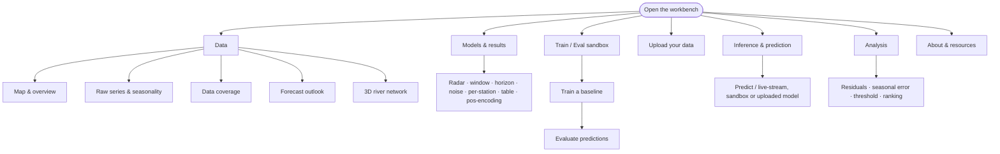

The audience split: **Explore** (Data) and **Analyse** are aimed at hydrologists;
**Models & results** reproduces the paper's comparisons; **Train/Eval**, **Upload** and
**Inference** let you bring your own data and model.

---

# Tab 1 — Data

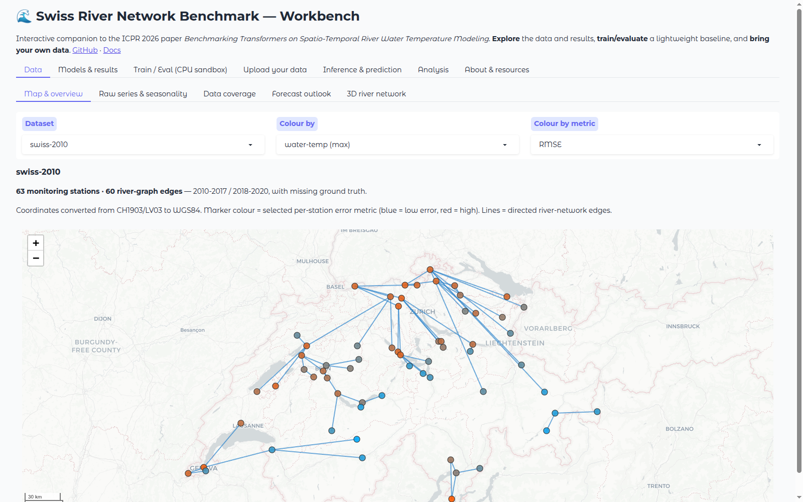

## 1.1 Map & overview

Places every monitoring station on a Swiss basemap with the directed river-network edges,
and colours each station by a chosen value.

**Steps:** ① pick a **Dataset** → ② pick what to **Colour by** (max/mean water temperature,
or a model's error) → ③ pick the **metric** used when colouring by a model.

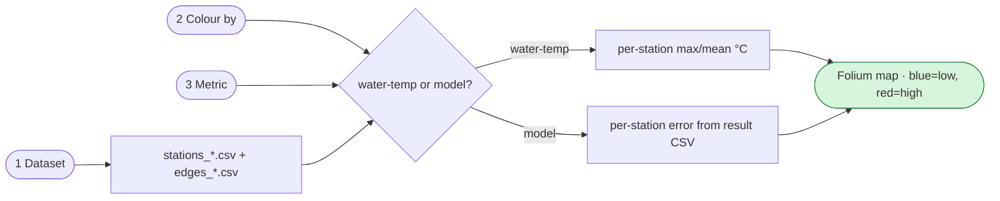

The overview text below the map states the station/edge counts, the train/test split, and
the CH1903→WGS84 coordinate conversion.

## 1.2 Raw series & seasonality

Shows a station's measured **air and water temperature** over time and its **day-of-year
climatology** (mean ± standard deviation).

**Steps:** ① Dataset → ② Station (the station list refreshes to match the dataset) → ③
Split (train / test).

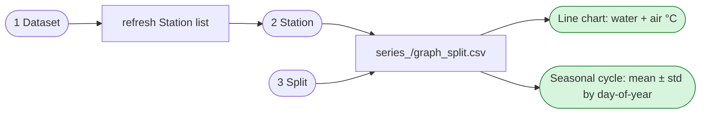

## 1.3 Data coverage

A heatmap of which station has a water-temperature value on which day — a fast way to see
gaps before modelling.

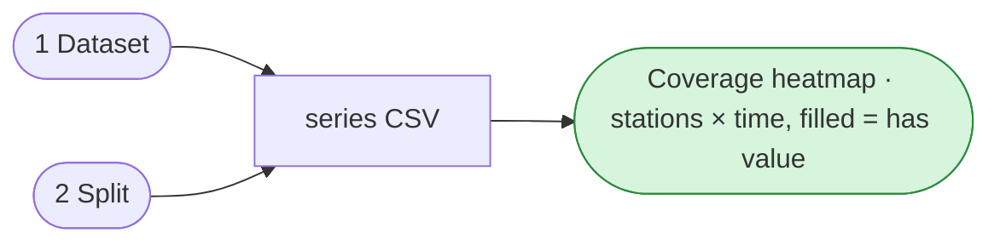

## 1.4 Forecast outlook

A drought-portal-style **probabilistic outlook**: a day-of-year climatology band (p10–p90)
with the median and an ecological threshold line for the coming weeks. Illustrative
(climatology-based), not an operational forecast.

**Steps:** ① Dataset → ② Station → ③ Threshold (e.g. 25 °C fish-stress) → ④ horizon slider
(7–56 days).

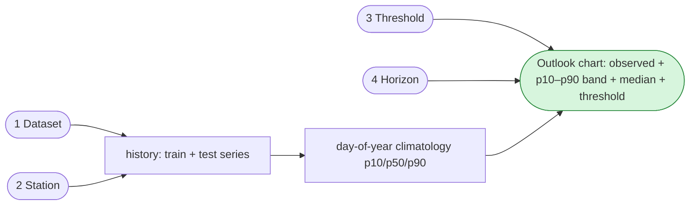

## 1.5 3D river network

An interactive **three.js** view: stations placed by longitude/latitude, raised and
coloured by the selected value; river edges on the base plane. Drag to rotate, scroll to
zoom.

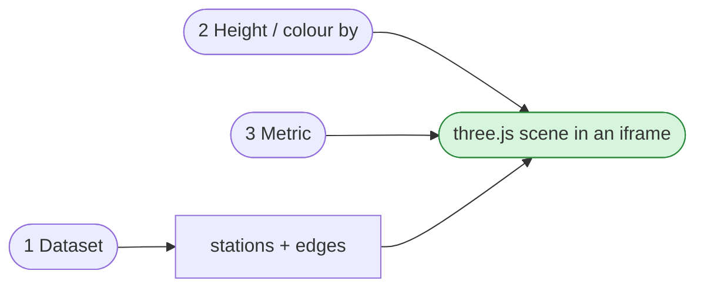

---

# Tab 2 — Models & results

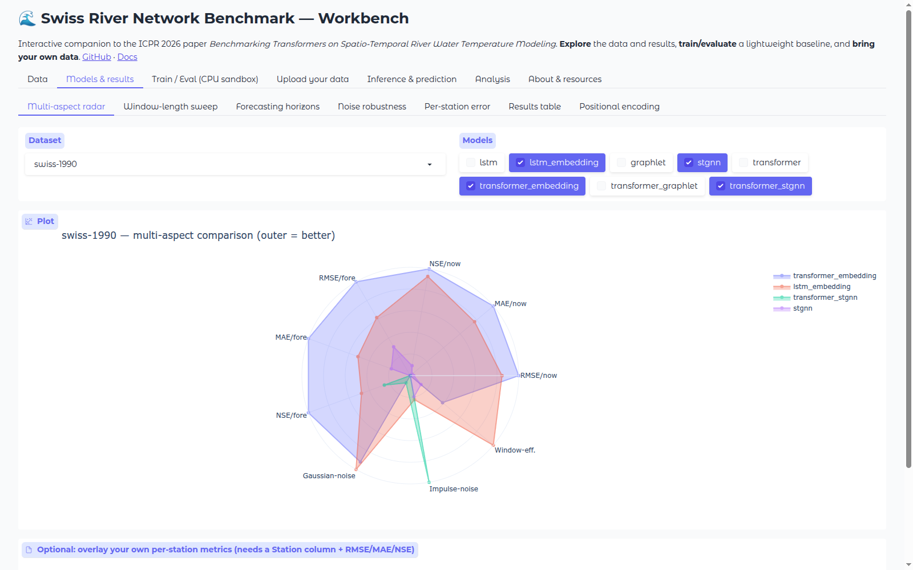

Every panel here regenerates a comparison from the committed result CSVs (Tier 0 — no GPU).

## 2.1 Multi-aspect radar

Normalised multi-aspect comparison (outer = better) of the selected models across
nowcasting/forecasting RMSE·MAE·NSE, noise robustness and window-efficiency. Optionally
**overlay your own** per-station metrics file.

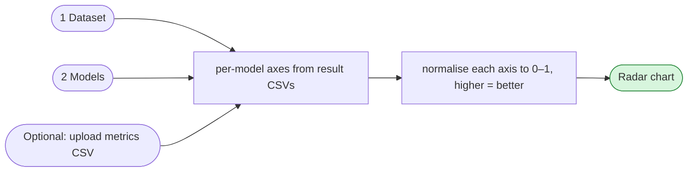

## 2.2 Window-length sweep · 2.3 Forecasting horizons · 2.4 Noise robustness

Three line-curve panels of the same shape: pick a **Dataset**, a set of **Models**, and a
**Metric**; each reads its dedicated result CSV and draws one curve per model.

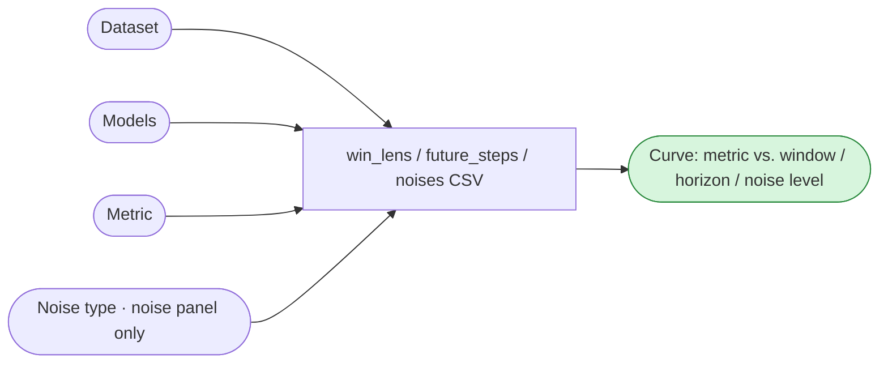

> Note: the noise panel picks its x-axis by noise type — `noise_level` for Gaussian,
> `probability` for impulse. (A bug where impulse always used `noise_level` and crashed was
> fixed during control testing — see [TEST_REPORT.md](TEST_REPORT.md).)

## 2.5 Per-station error · 2.6 Results table · 2.7 Positional encoding

- **Per-station error** — a bar chart of one model's error at each station (Dataset /
  Model / Metric).
- **Results table** — the RMSE/MAE/NSE table for a Dataset × Scenario (nowcasting /
  forecasting) × Statistic (mean/median/std/min/max).
- **Positional encoding** — a live heatmap of the sinusoidal positional encoding for a
  chosen `d_model` and sequence length (an explainer, computed on the fly).

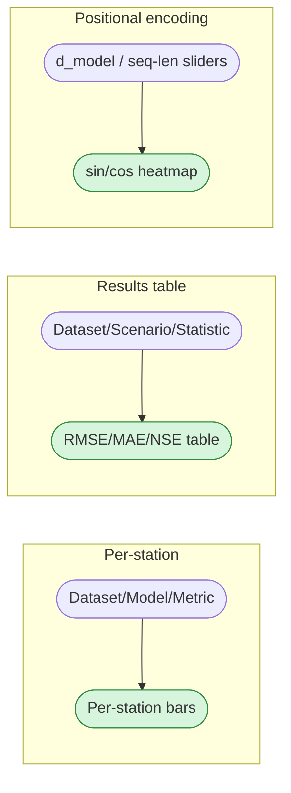

---

# Tab 3 — Train / Eval (CPU sandbox)

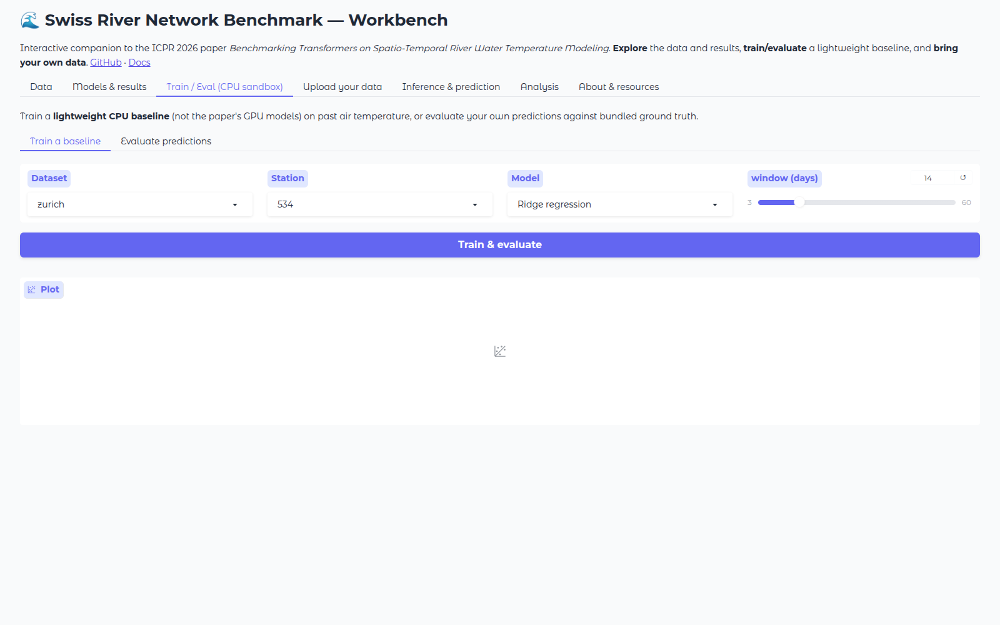

## 3.1 Train a baseline

Fits a **lightweight CPU model** (ridge regression or a small MLP) on a window of past air
temperature for one station — in seconds, no GPU. The trained model is remembered and
becomes the *"Last trained sandbox model"* used by the Inference and Analysis tabs.

**Steps:** ① Dataset → ② Station → ③ Model (Ridge / MLP) → ④ window slider → ⑤ **Train &
evaluate**.

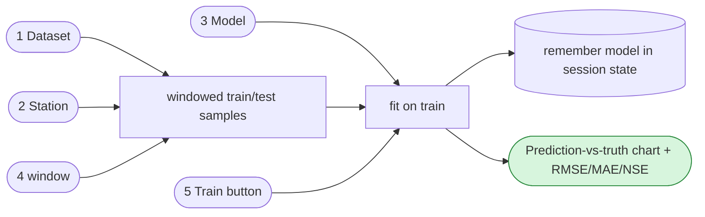

## 3.2 Evaluate predictions

Upload a CSV with a numeric prediction column; it is aligned to a station's bundled test
ground truth and scored with RMSE/MAE/NSE.

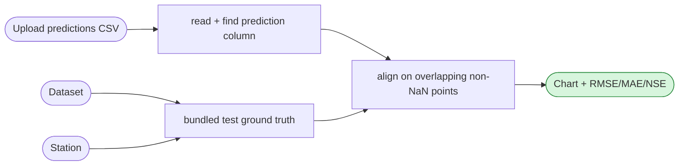

---

# Tab 4 — Upload your data

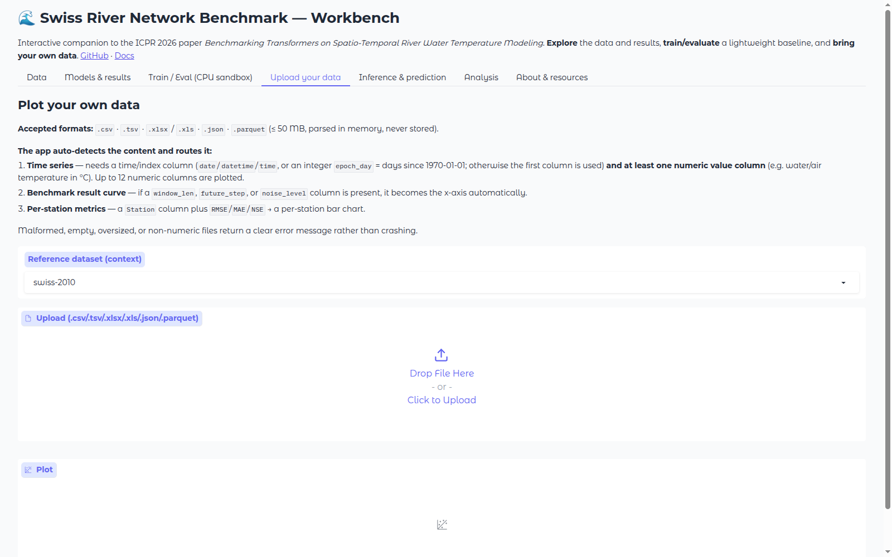

Upload any table (`.csv/.tsv/.xlsx/.xls/.json/.parquet`, ≤ 50 MB, parsed in memory, never
stored). The app **auto-detects** the content and routes it to the right view; malformed,
empty, oversized or non-numeric files return a clear message rather than crashing.

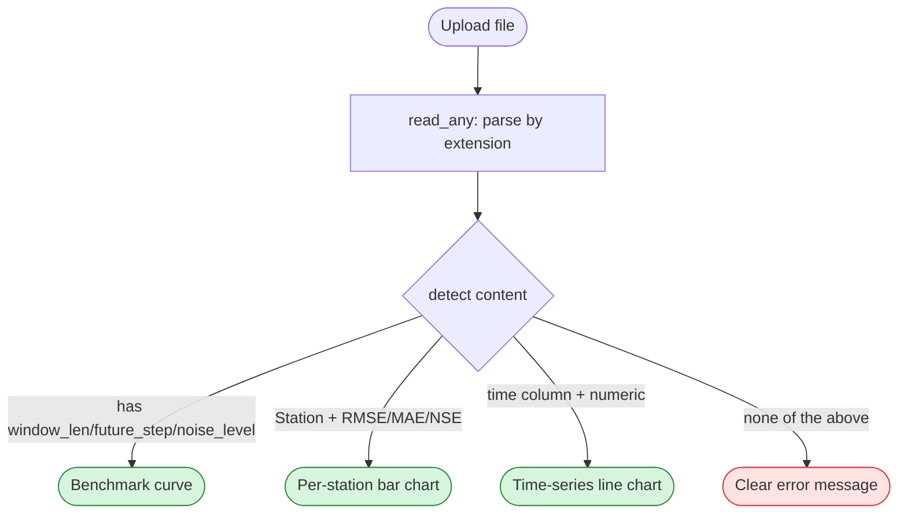

---

# Tab 5 — Inference & prediction

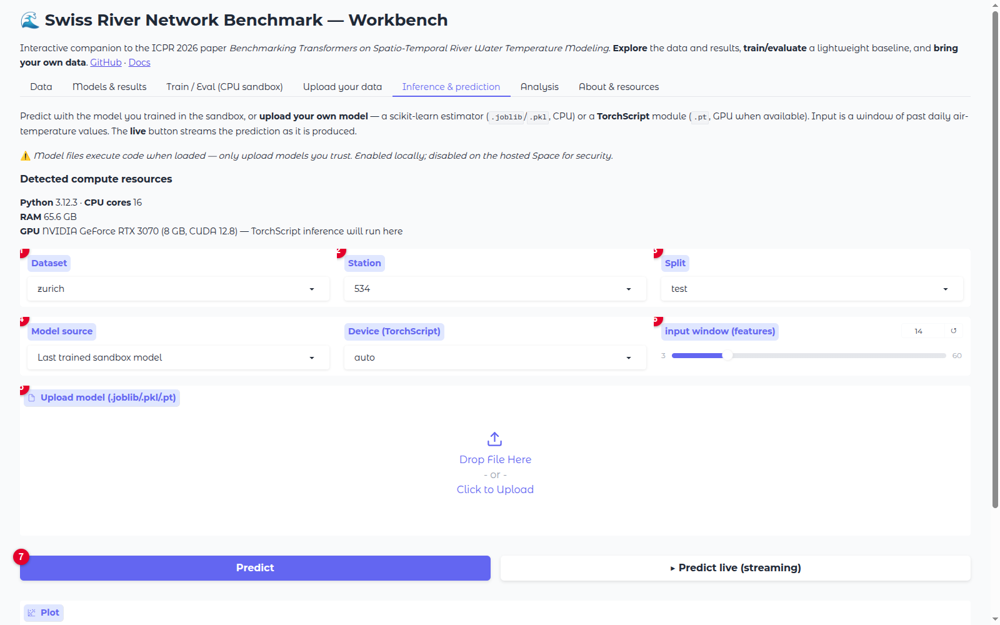

Predict a station's water temperature with **your own model** or the sandbox model. A
scikit-learn estimator (`.joblib`/`.pkl`) runs on CPU; a **TorchScript** module (`.pt`)
runs on a **GPU when one is auto-detected** (the detected compute is shown at the top),
otherwise CPU. The **Predict live** button streams the prediction point-by-point.

> Security: model files execute code when loaded, so **model upload is enabled only
> locally and disabled on the hosted Space**.

**Steps (numbered on the screenshot):** ① Dataset → ② Station → ③ Split → ④ Model source
(sandbox or uploaded) → ⑤ upload a model if chosen → ⑥ input window (must match the model's
feature count) → ⑦ **Predict** or **Predict live**.

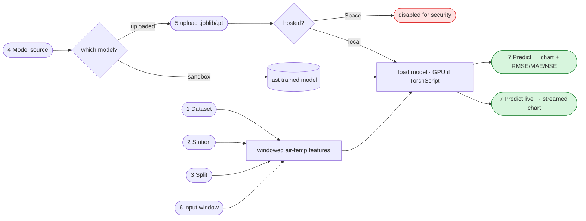

---

# Tab 6 — Analysis

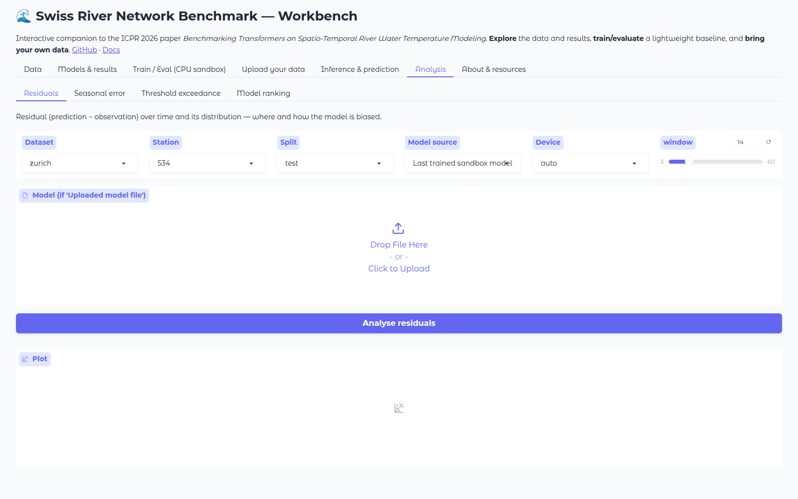

A decision-support layer over the same predictions. Each sub-tab uses the sandbox or an
uploaded model (same controls as Inference).

## 6.1 Residuals

Prediction − observation over time and its distribution; reports bias, spread, and the
fraction of days with |residual| > 2 °C.

## 6.2 Seasonal error

Mean absolute error by calendar month — is the model worst in the summer fish-stress
season?

## 6.3 Threshold exceedance

Observed days per year a station exceeds a temperature limit (e.g. 25 °C) — the most
directly useful view for a water manager. (Uses observations only; no model needed.)

## 6.4 Model ranking

Ranks all eight benchmarked architectures by their mean per-station error on a dataset.

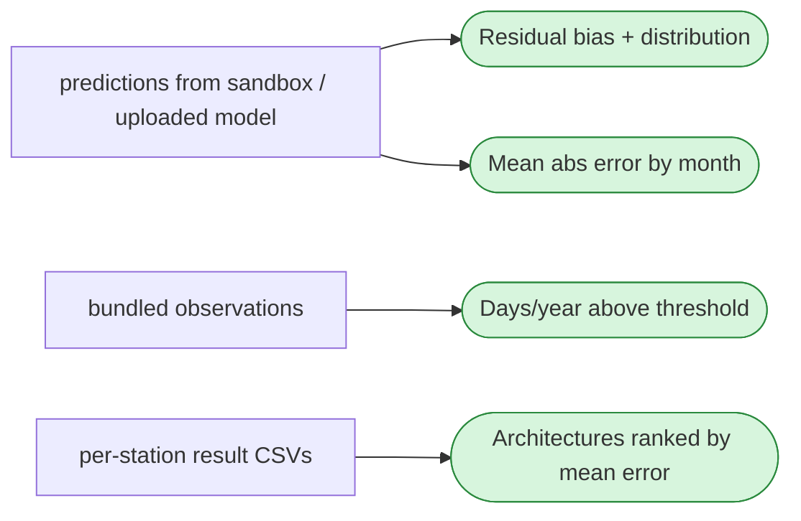

---

# Tab 7 — About & resources

Static page: the detected compute summary (Python, CPU cores, RAM, GPU) and links to the
GitHub repository, documentation and the ICPR 2026 paper. No interactive controls.

---

## Where the data comes from

All views read the **released benchmark artifacts** bundled with the app
(`swissrivernetwork/app/data`): station coordinates and edge lists (CH1903→WGS84), the
per-station raw series, and the aggregate/per-station result CSVs. Uploaded files are
parsed in memory and never persisted. The compute footprint is shown live on the Inference
and About tabs.
